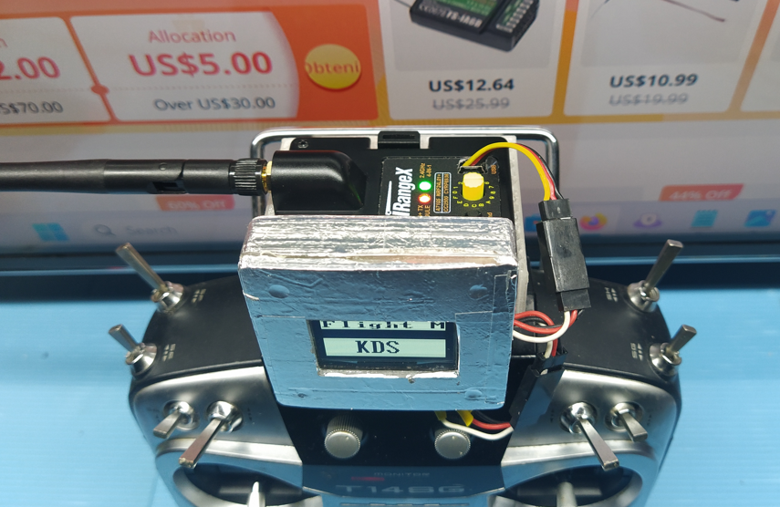
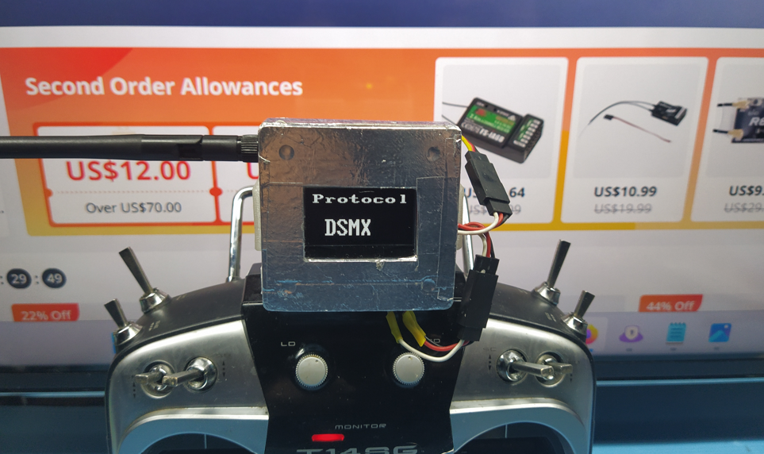
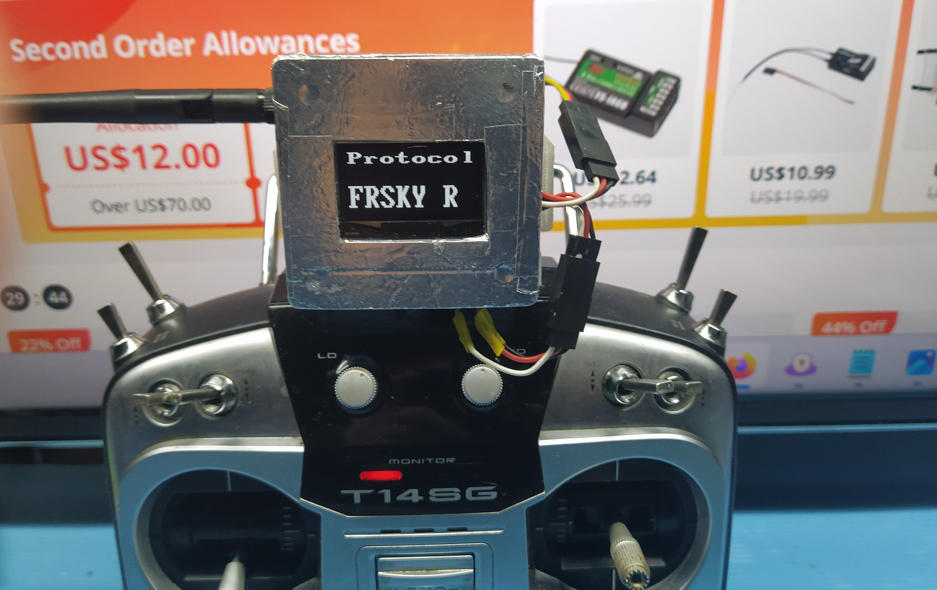
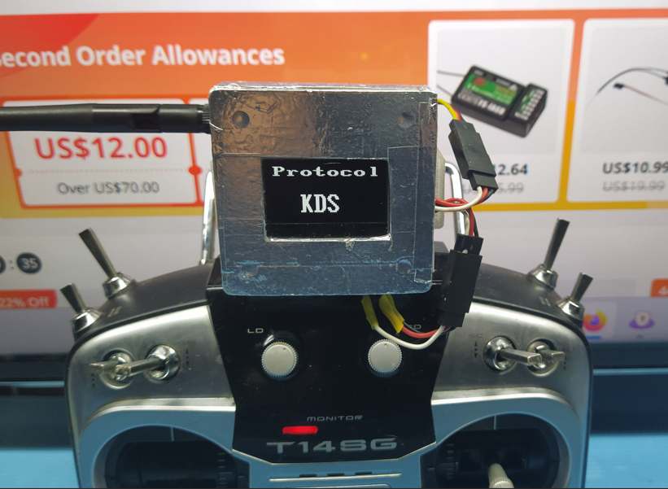

# Futaba-Multiprotocol
Serial Multiprotocol interface for Futaba or every transmitter with PPM interface ( via trainer port ).

**Goal:** Give to all Futaba radios and more in general to all PPM capable radios, the possibility to use the multiprotocol module Banggood iRangeX IRX4 Plus via **serial connection**. 

**Adavantages:**  
1: Use your own trusted transmitter. 
2: Use transmitter that has proprietary firmware, stable and solid( e.g. Futaba, Spektrum, Jr ... ) 
**3: Avoid "Loss of conformity" (EU law 2019/947) of your trasmitter installing firmwares versions of OpenTx or EdgeTx, not certified by the constructor.** 
4: Save money, no need to buy other trasmitters. 
5: Using the multiprotocol module Banggood iRangeX IRX4 Plus in **serial mode** is far more simpler and safer then using **PPM mode**, no need to select protocol via the knob and bank of memory. Also avoid the risk to destroy contacts of the knob. 

**USAGE** 
After turning on the transmitter, the last used protocol is prompted. 
After 10 seconds the prompted protocol is activated unless ailerons stick is moved. 
Moving ailerons stick you can change the protocol to be activated(see pictures below). 
Once done you can move down elevator stick or wait 10 seconds to activate the selected protocol. 
See the picture above with radio in flight mode. 
**Important: For security reason once protocol is activated (Flight Mode), it cannot be changed anymore. Need to recicle power.** 

**BINDING procedure** 
After turning on the transmitter, move elevator stick UP to activate binding procedure as shown on the display. 
You have 10 seconds to put receiver on bind mode if not done before. After 10 seconds system will return to protocol selection. 

**Power consumption** 
With Futaba T14SG power consumption with internal module is 152mah. 
With this system and Banggood iRangeX IRX4 Plus 2.4G power consumption is almost identical, 153mah. 
So no issue with battery. 

**BOM**

1 x Arduino nano 
1 x Oled display SH1106 
1 x Banggood iRangeX IRX4 Plus 2.4G CC2500 NRF24L01 A7105 CYRF6936 4 IN 1 
1 x Sdcard module (Optional) 

No source code will be available at the moment, just the binary to upload to arduino nano. 

Waiting to test Banggood IRangeX IRX4 LITE. 

**Hoping Banggood can create a IRangeX IRX4 with this system embended.** 
**I know that many people are not able to do it by themselves. They deserve one.** 

**Connection diagrams** 
<pre>
Oled Display
_______________
Nano  SH1106 
 A4    SDA 
 A5    SCL 
 5V    VCC 
GND    GND 
</pre>
<pre>
POWER
_______________ 
NANO      TX
VIN      8.4+ ( should work also with 3s but not tested )
GND      GND
</pre>
<pre>
PPM in from TX to nano
_______________
NANO     TX
 D2     PPM signal out
</pre>
<pre>
Nano Serial to Multiprotocol module
_______________
NANO    MPM
TX1     Serial in
VIN     +BAT
GND     -GND
</pre>
<pre>
MPM Pinout
_______________
___________
|         |
|         |
|         |
|         |
|        x|  Serial In  
|        x|
|        x|  +Bat
|        x|  -GND 
|________x|
</pre>

